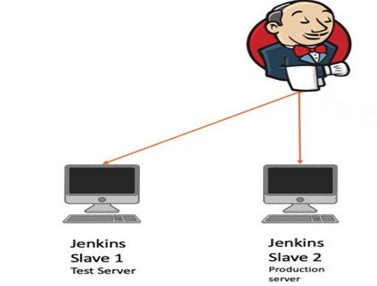

# Create a Jenkins CI CD pipeline to deploy project website on AWS
## Problem statement:
Need to implement CI CD pipeline on jenkins as per below instructions –
* Create a jenkins master node and two slave nodes (slave 1 Test server) and (slave2 Production server) at AWS.
* Configure jenkins thus it Install the project website from git at slave-1 testing server on docker first, if successful then it should built the project website on slave2-production server. 
* Create pipeline view and Trigger the job using git web-hooks , whenever any change at git repository then jenkins should notify it and jenkins will automatically start build process.

## Prescription:
1.	Create Jenkins Master and slave infrastructure at AWS 
2.	Check git repository
3.	Install docker at slave nodes
4.	Configure build job for Testing server
5.	Configure build job for Production server
6.	Configure job; after Test server job done success it will build job for Production server 
7.	Create Pipeline view to run the job
8.	Create Web hook to initiate job when commit has made at GIT repository

## Implementation:
1.	Create Jenkins Master and slave infrastructure at AWS
create Jenkins master and slave architecture in AWS like below in AWS . here one instance will be Jenkins master and other two instances will be jenkins slave nodes namely Testing server and Production server 

** To create the infrastrucre perform below steps:

* Launch three instance at AWS with Ubuntu:18.04 AMI , note that all three nodes need to be in same aviability zone, otherwise AWS can charge for bandwidth for different aviability zone.
