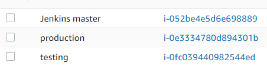

# Create a Jenkins CI CD pipeline to deploy project website using docker container on AWS
## Problem statement:
Need to implement CI CD pipeline on jenkins as per below instructions –
* Create a jenkins master node and two slave nodes (slave 1 Test server) and (slave2 Production server) at AWS.
* Configure jenkins thus it Install the project website from git at slave-1 testing server on docker first, if successful then it should built the project website on slave2-production server. 
* Create pipeline view and Trigger the job using git web-hooks , whenever any change at git repository then jenkins should notify it and jenkins will automatically start build process.

## Prescription:
1.	Create Jenkins Master and slave infrastructure at AWS 
2.	Check git repository
3.	Install docker at slave nodes
4.	Configure build job for Testing server
5.	Configure build job for Production server
6.	Configure job; after Test server job done success it will build job for Production server 
7.	Create Pipeline view to run the job
8.	Create Web hook to initiate job when commit has made at GIT repository

## Implementation:
1.	Create Jenkins Master and slave infrastructure at AWS
create Jenkins master and slave architecture in AWS like below in AWS . here one instance will be Jenkins master and other two instances will be jenkins slave nodes namely Testing server and Production server 


### To create the infrastrucre perform below steps:

* Launch three instance at AWS with Ubuntu:18.04 AMI , note that all three nodes need to be in same aviability zone, otherwise AWS can charge for bandwidth for different aviability zone.



* Allow port 22, 80, ICMP, 8080 in security group 

* Create ssh key at Jenkins master node and copy them to slaves nodes authorized_keys section and login from jenkins master node to all slave nodes once
```
ubuntu@ip-172-31-47-27:~$ cd ~ 
ubuntu@ip-172-31-47-27:cd .ssh/
ubuntu@ip-172-31-47-27:~$ ssh-keygen
Generating public/private rsa key pair.
Enter file in which to save the key (/home/ubuntu/.ssh/id_rsa):
Enter passphrase (empty for no passphrase):
Enter same passphrase again:
Your identification has been saved in /home/ubuntu/.ssh/id_rsa.
Your public key has been saved in /home/ubuntu/.ssh/id_rsa.pub.
The key fingerprint is:
SHA256:JghMm5W3533KM4isNY3KS/UHnAx4dxa3+tmlLcNaxFU ubuntu@ip-172-31-47-27
The key's randomart image is:
+---[RSA 2048]----+
|  . ..    . .   E|
| o +...    o .  .|
|  = ..o.. o .   .|
|   . o.=.+ . . . |
|    . ooS..   o .|
|     . *.....= + |
|    ..+.oo.oo B .|
|   o oo...=  o o |
|    =o     o.    |
+----[SHA256]-----+

cat id_rsa.pub
ssh-rsa AAAAB3NzaC1yc2EAAAADAQABAAABAQC2INJ3xTJnUepfMyLnqQB6IojESx+44/QKWbLpeWJsJUHaLh6k9nscZVt8OD4XA/cTPCrhhrcciC0p9PHK4xF+HHDavvesQSjTlxzevv5GLFTbGNsyFLvHunpFA1Zwh0YbaASJB9VhGkasHwa2uQ2iPDvC5lv20cmsWVXrL9+ODDNpDTrsGv+ntGzjcD1ETiRjvDXALrUy2c0g8mJQIa92Ie3nQTUtbKZiDsusEE2Px/D2GazgQiuLQ6n3q4Wyp/WrLJsLV2FVj4I4ZClDCQWq4UXymKDXebUhIo3jbP5+/hjC/PDo2mqWS8E4u9fwWofJokIOWFZfnDfOrxdmgPfF ubuntu@ip-172-31-47-27

```

Now the newly created ssh keys need to install at both slaves nodes at authorized_keys section.login at both slaves nodes and paste it into authorized_key section :
```
cd ~/.ssh/
echo AAAAB3NzaC1yc2EAAAADAQABAAABAQC2INJ3xTJnUepfMyLnqQB6IojESx+44/QKWbLpeWJsJUHaLh6k9nscZVt8OD4XA/cTPCrhhrcciC0p9PHK4xF+HHDavvesQSjTlxzevv5GLFTbGNsyFLvHunpFA1Zwh0YbaASJB9VhGkasHwa2uQ2iPDvC5lv20cmsWVXrL9+ODDNpDTrsGv+ntGzjcD1ETiRjvDXALrUy2c0g8mJQIa92Ie3nQTUtbKZiDsusEE2Px/D2GazgQiuLQ6n3q4Wyp/WrLJsLV2FVj4I4ZClDCQWq4UXymKDXebUhIo3jbP5+/hjC/PDo2mqWS8E4u9fwWofJokIOWFZfnDfOrxdmgPfF ubuntu@ip-172-31-47-27  >> .ssh/authorized_keys
```
* Then from jenkins master node ssh login to upcoming slave node at once
   `ssh ubuntu@slave-private-ip`

* Install Jenkins at Jenkins master server
```
sudo apt update
sudo apt install openjdk-8-jdk -y
wget -q -O - https://pkg.jenkins.io/debian-stable/jenkins.io.key | sudo apt-key add -
sudo sh -c 'echo deb https://pkg.jenkins.io/debian-stable binary/ > \
/etc/apt/sources.list.d/jenkins.list'
sudo apt-get install jenkins -y
service jenkins status
● jenkins.service - LSB: Start Jenkins at boot time
   Loaded: loaded (/etc/init.d/jenkins; generated)
   Active: active (exited) since Fri 2020-10-23 13:35:14 UTC; 1min 37s ago
     Docs: man:systemd-sysv-generator(8)
  Process: 19407 ExecStart=/etc/init.d/jenkins start (code=exited,
```
Now login at Jenkins GUI , first need to collect admin password from below file and put it to login page
```
cat /var/lib/jenkins/secrets/initialAdminPassword
42467d9c18db461687498744acf6c9db
And then login and install suggested plugin from GUI page 
Finaly login to Jenkins GUI on port 8080
```

* Install java at slave nodes 
```
sudo apt update
sudo apt install openjdk-8-jdk -y
```
* Configure Jenkins slave and connect with master

Login slave nodes and create directory
``` 
sudo mkdir -p /home/ubuntu/jenkins
sudo chmod 777 /home/ubuntu/jenkins
```
then perform this step at Jenkins master GUI
```
Jenkins master GUI -> 
Manage Jenkins -> 
Manage node and cloud -> 
New node ->

then below parameters 

Node name = testing server

Click permanent agent

Remote root directory = /home/ubuntu/jenkins

Usage = Use this node as much as possible 

Launch method = Launch agents via SSH

Host = private ip of the testing server  (172.31.36.7)

Then press Add key and give following parameters :

Domain: Global

 Kind : SSH username with private key

Username : ubuntu

Private key : copy private key from jenkins master file .ssh/id_rsa file and paste here

Host Key Verification Strategy : Manually trusted verification strategy

```


Similar way connect production server as well. Then finally you will able to see two slave nodes testing and production server as synced state as showing below


2.	Check git repository: 
remore git reposatory for project website source code 'https://github.com/asif-ops/asif-ops.github.io.git' directory where we can see the sample project website source code and a dockerfile exists as showing below:


Content of the docker file is showing following. the purpose of this docker file is to deploy a docker container at target slave node with ubuntu 18.04 image and install apache service and add project cloned website source code (mainly specified: index.html and src directory) to apache /var/www/html directory. This finally start the apache service.

```
FROM ubuntu:18.04
RUN apt-get update -y
RUN apt-get install apache2 -y
ADD . /var/www/html/
CMD ["apache2ctl","-D","FOREGROUND"]
```

3.	Install docker at slave nodes:

To install the project on slaves nodes need to install the docker first, run below commands at slave nodes
```
sudo apt-get update
sudo apt-get install docker.io –y
```

4.	Configure build job for Testing server

First create job for testing server at Jenkins GUI , following steps:
Jenkins GUI dashboard-> Create a job -> Freestyle project -> Enter a item name i.e slave_tesating -> Ok -> GitHub project -> Project URL = https://github.com/asif-ops/asif-ops.github.io.git -> Source Code Management -> Git -> Repository URL = = https://github.com/asif-ops/asif-ops.github.io.git -> Restrict where this project can be run -> Label expression = testing (as this project will run at testing so restricting to testing server only by this option) -> Save -> So now we can check connections status between jenkins master and slave 

Below is the screenshot of the important steps below 


Now click on “Build Now” and check whether build step success or not , if the build button show blue color then build step is success 


After build now we see that build process is successful as build process is showing blue color 


Now login to testing server and check that whether build step is success or not. We see that at under /home/ubuntu/jenkins/workspace/testing_slave  our remote git repository is created as showing below :

```
ubuntu@ip-172-31-12-142:~/jenkins/workspace/testing_slave$ pwd
/home/ubuntu/jenkins/workspace/testing_slave
ubuntu@ip-172-31-12-142:~/jenkins/workspace/testing_slave$ ls
Dockerfile  docker_check.sh  index.html  src
```

if I go to workspace of testing sever at jenkins  GUI then it also shows content of the git repository . So that means from our master Jenkins we can successfully can connect to our slave node and apply job successfully


Now go back to configure the build job 


* Build -> Execute shell 
Execute shell will basically run shell commands that need to run to perform the build step 
this will make this script file executable. function of this script 
file is to rm any running container from the testing server if exists
```
sudo chmod +x docker_check.sh
sudo ./docker_check.sh  > /home/ubuntu/jenkins/output.txt 
docker buid
sudo docker build . -t web
docker run the website on port 82
sudo docker run -it -d -p 82:80 web
check docker process
sudo docker ps 
then check website on localhost on port 82
sudo curl localhost:82
```
Configure -> Build -> Execute shell 


Now “Save” . Our job now has saved and next thing we need to do lets go ahead and run this job .Lets go to jenkins dash board and run “Build Now” 


Now we see the build process is success for this step


Also we can see the console output of this build process for the log if there is any error 
Finally we can browse the website at instance public IP at por t82 to see the website content as showing bellow . this is the project website , which tested at testing sever successfully 


5.	Configure build job for Production server

Now configure the Production server build job same like Testing server  as per below steps:
```
Jenkins GUI dashboard -> 
Free style project -> 
New Item -> 
Enter an item name: Prodcuction server ->  
Jenkins GUI dashboard-> 
Create a job -> 
Freestyle project -> 
Enter a item name i.e slave_tesating -> 
Ok -> 
GitHub project -> 
Project URL = https://github.com/asif-ops/asif-ops.github.io.git -> 
Source Code Management -> 
Git -> 
Repository URL = = https://github.com/asif-ops/asif-ops.github.io.git -> 
Restrict where this project can be run -> 
Label expression = production (as this project will run at production so restricting to production server only by this option) -> 
Build Step -> 
Execute shell commands (here use the same commands as testing server ) -> 
Save -> 
Run the build step and verify whether the production server has deploy the project successfully or not 
```
Execute shell will basically run shell commands that need to run to perform the build step 
this will make this script file executable. function of this script 
file is to remove any running container from the production server if exists
```
sudo chmod +x docker_check.sh
sudo ./docker_check.sh  > /home/ubuntu/jenkins/output.txt 
docker buid
sudo docker build . -t web
docker run the website on port 82
sudo docker run -it -d -p 82:80 web
check docker process
sudo docker ps 
then check website on localhost on port 82
sudo curl localhost:82
```
Now we see the build project color if it is blue, that build job is running successfully 

Now we can browse the production server public IP at port 82 and can see the website contents as showing below picture. Now testing is successfully at both production and testing server. At coming section we will see how to make a job where it will run job at production server after job successfully run at testing server.

6.	Configure job; after Test server job done success it will build job for Production server
Above steps we found that build job running succesfully at both production and testing server. 
Now we need to create a job where a job which will deploy job at production server
once job done successfully at testing server. To do that follow below steps:
```
Jenkins GUI ->  
testing  server -> 
Configure -> 
Post-build Actions  -> 
Select “Build other projects” from dropdown -> 
Projects to build = Prodcuction server -> 
Trigger only build is stable
```
Now test the build process by build now on testing serve “Builld now”. After test we found that build process for testing server and after that build job production is also successful 
first, Testing server build job , if succcess then post build action below 
second, Production server build job 
Browse production server ip on port 82 and found that project is website is successful l. 

7.	Create Pipeline view to run the job

First install the pipeline plugin by:
```
Jenkins GUI dashboard ->  
Manage jenkins -> 
Manage plugins ->
 Availavble -> 
 search “build pipeline” -> 
 Build Pipeline -> 
 Install without restart 
```
Now start create build pipeline view 
```
Jenkins GUI dashboard -> 
click + sign -> 
select “Build pipeline view” -> 
just give a view name -> 
ok -> 
Select initial Job = Testing server -> 
OK 
```


Then finally Build view will look like below 


Now click on “run” on same page and we found that Buile pipeline CICD has run successfully at slave node first and then it run the build at production node as showing below 


8.	Create Web hook to initiate job when commit has made at GIT repository 

```
Jenkins GUI dashboard -> 
Testing server -> 
Configure -> 
Build Triggers -> 
GitHub hook trigger for GITScm polling -> 
Save 
```


```
Now go to github repository -> 
settings -> 
Webhooks -> 
Add Webhook  -> 
Payload URL = Your jenkins server IP:port - github-webhook/ (in this case http://13.232.199.239:8080/github-webhook/) > Add webhook 
```


Then if everything working fine then  it will show you a tick mark as show below


Now commit some changes to your Git hub repository.  In this case I did some change at index.html file and push the change to git hub . now as soon new code has been pushed to github then jenkins build starts job and job done successfully 
Git hub updated:


Jenkins do new build job:


* ---------------Finish , build pipeline on jenkins done successfully----


